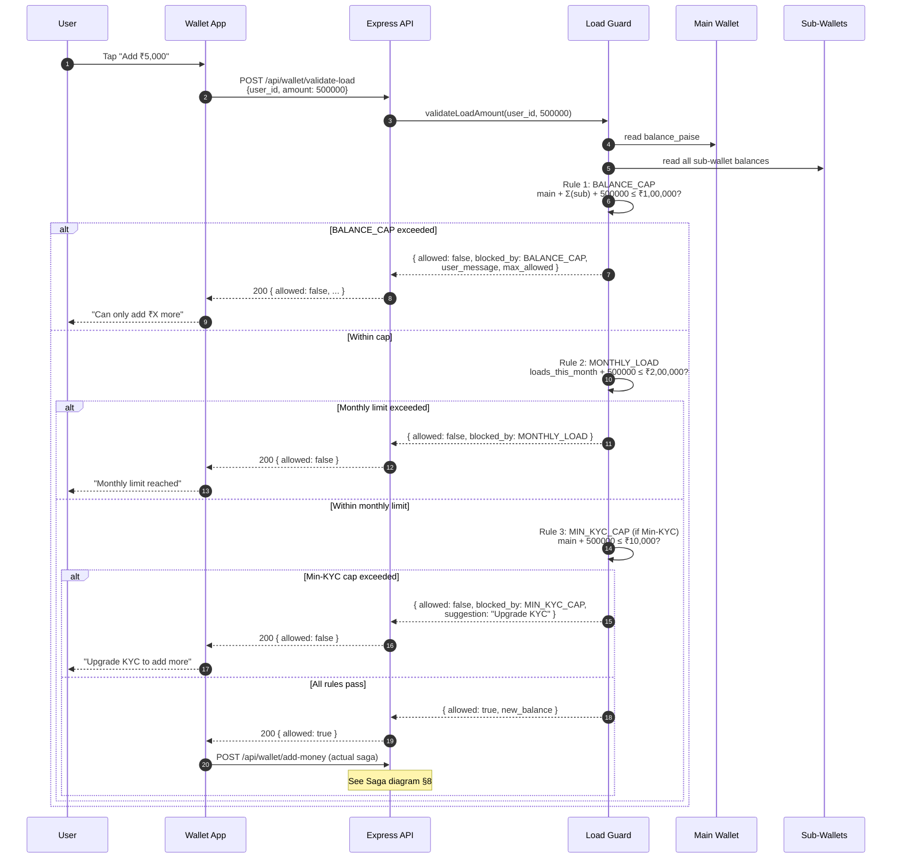
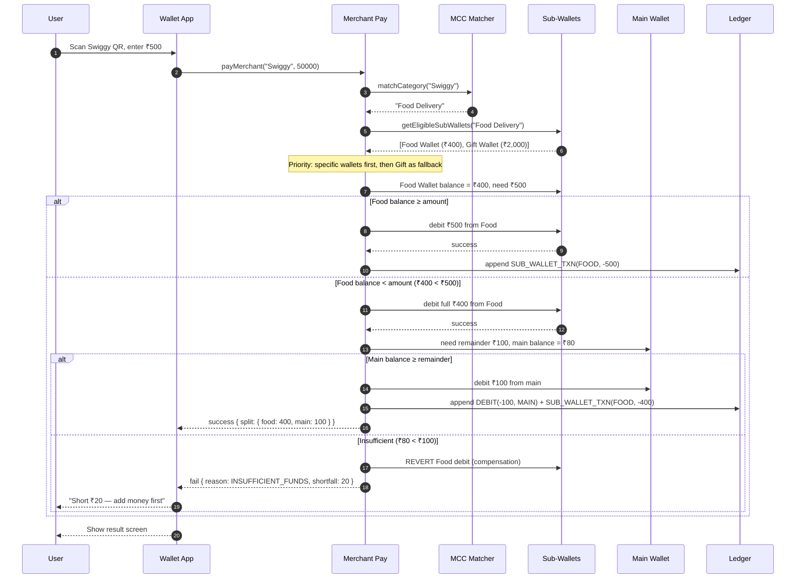
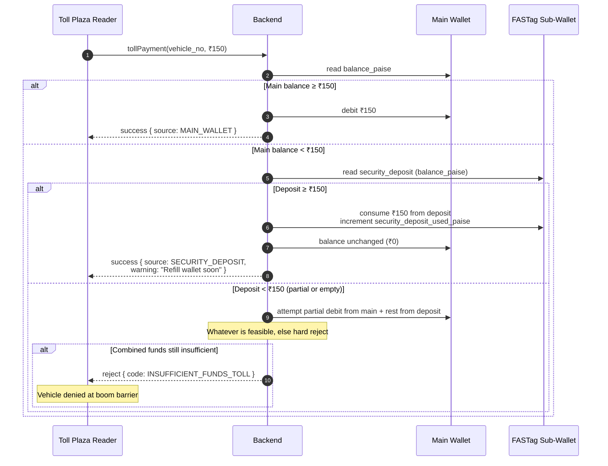
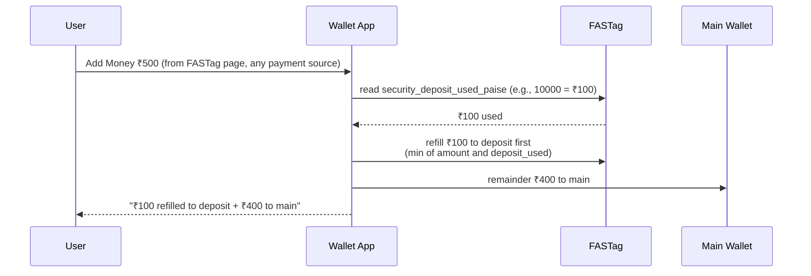
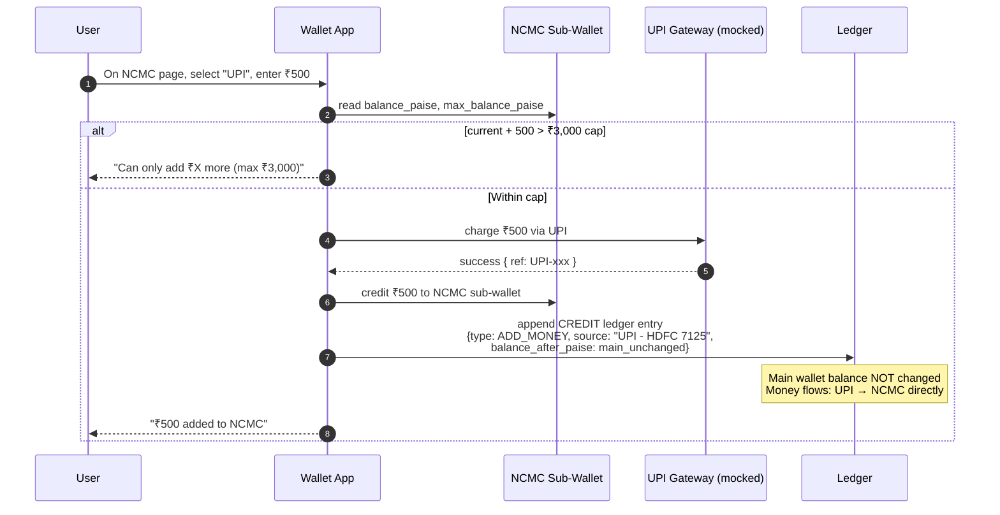
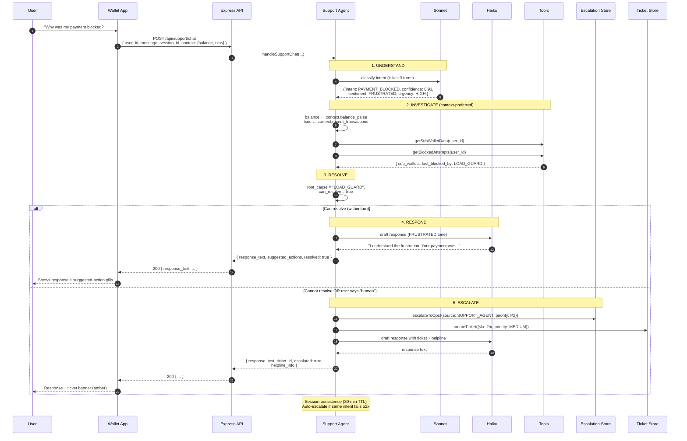
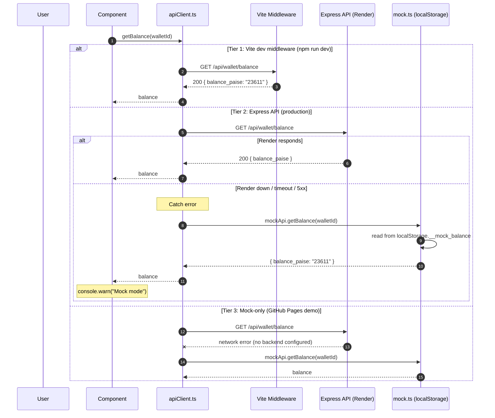
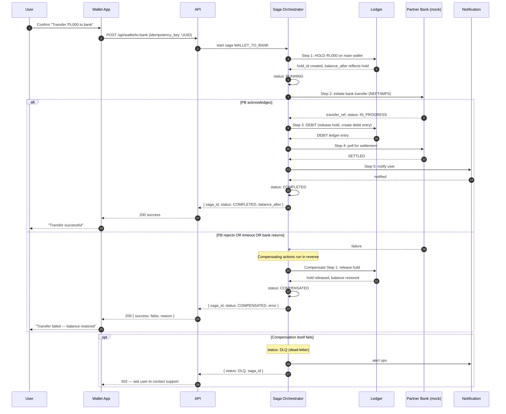
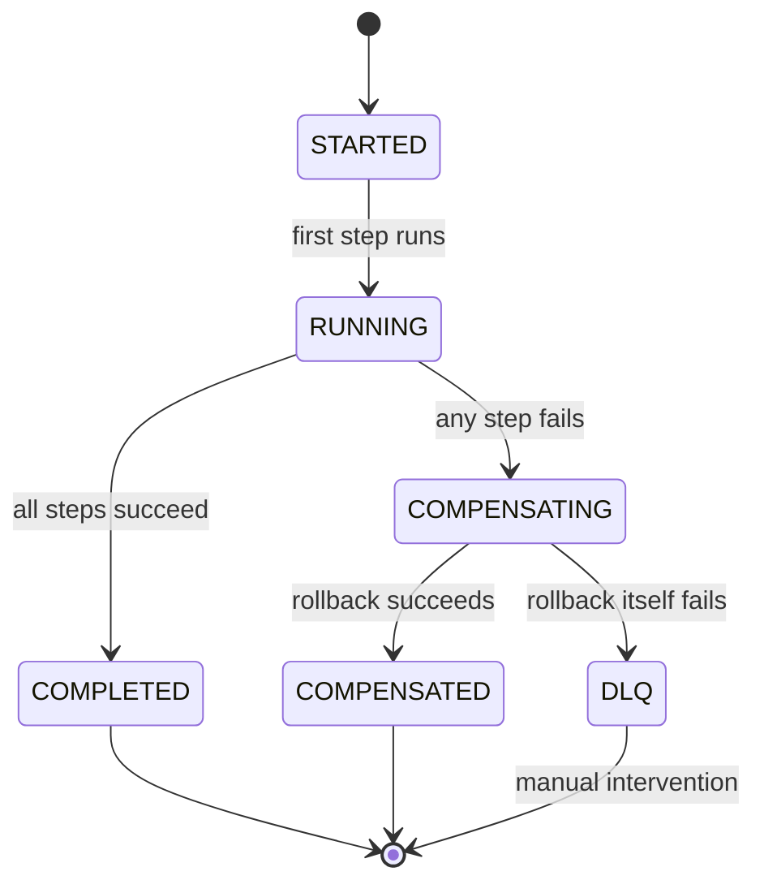

# Sequence Diagrams

Mermaid diagrams for the platform's critical flows. GitHub renders these inline; for local preview use the Mermaid CLI or any Markdown viewer with Mermaid support.

## Table of Contents

- [1. Load Guard Validation](#1-load-guard-validation)
- [2. Cascade Spend (Merchant Pay)](#2-cascade-spend-merchant-pay)
- [3. FASTag Toll Transaction](#3-fastag-toll-transaction)
- [4. NCMC Direct Load from UPI](#4-ncmc-direct-load-from-upi)
- [5. KYC Upgrade Agent Flow](#5-kyc-upgrade-agent-flow)
- [6. Support Agent Flow with Escalation](#6-support-agent-flow-with-escalation)
- [7. 3-Tier API Fallback](#7-3-tier-api-fallback)
- [8. Saga Transaction Lifecycle](#8-saga-transaction-lifecycle)

---

## 1. Load Guard Validation

Every Add Money request runs 3 Load Guard rules before the saga starts.



### Key properties

- **Order matters** — BALANCE_CAP runs first (cheapest check, fails most commonly)
- **Read-heavy** — sub-wallet aggregation reads 5+ records per request
- **Stateless** — Load Guard doesn't mutate; only the saga does
- **Race window** — between validate and actual save; in production, re-check inside the saga

---

## 2. Cascade Spend (Merchant Pay)

Merchant Pay auto-detects category and cascades across applicable sub-wallets before falling back to main.



### Notes
- **Rollback on partial failure** is critical — never leave Food debited if main couldn't cover remainder
- **Gift fallback** only triggers if no category-specific wallet matches (universal eligibility)
- **NCMC is NEVER in the eligible list for non-transit** — hard-rejected at `getEligibleSubWallets`

---

## 3. FASTag Toll Transaction

Toll hits deduct from main wallet first; security deposit is the safety net.



### On next Add Money



---

## 4. NCMC Direct Load from UPI

NCMC can load directly from UPI/DC/NB, bypassing main wallet (ADR-005 amended).



### Why this is safe re: RBI cap

- `main + Σ(sub_wallets)` still enforced on load (Load Guard runs before credit)
- NCMC cap (₹3,000) enforced separately
- Combined cap (₹1,00,000) would have rejected earlier if violated
- Ledger entry preserves audit trail (even though main balance unchanged)

---

## 5. KYC Upgrade Agent Flow

The 7-step autonomous loop run daily at 8 AM IST.

```mermaid
sequenceDiagram
    autonumber
    participant C as Cron (8 AM IST)
    participant A as KYC Agent
    participant DB as Mock Data
    participant S as Claude Sonnet
    participant H as Claude Haiku
    participant E as Escalation Store
    participant N as Notification Store

    C->>A: runKycUpgradeAgent()

    Note over A,DB: 1. PERCEIVE
    A->>DB: queryKycExpiry(days_ahead: 7)
    A->>DB: enrich with balance, transactions, sub-wallets
    DB-->>A: [userContexts]

    Note over A,S: 2. REASON (5-shot)
    loop per user
        A->>S: classify(user + 5 exemplars)
        S-->>A: { priority, strategy, tone, offer, escalate_immediately }
    end

    Note over A: 3. PLAN
    A->>A: sort by priority (P1 first); build actions[]

    Note over A,H: 4. ACT
    loop per user with outreach
        A->>H: draft SMS (≤160 chars)
        H-->>A: SMS text
        A->>H: draft in-app notification (JSON)
        H-->>A: { title, body, cta_button }
        A->>N: store notification
        opt escalate_immediately == true
            A->>E: escalateToOps({source: KYC_AGENT, priority: P1})
        end
    end

    Note over A: 5. OBSERVE (simulated)
    A->>A: check each user's response status

    Note over A,E: 6. FOLLOW-UP / ESCALATE
    loop per user observation
        alt UPGRADED
            A->>A: close case, grant reward
        else CTA_TAPPED_NO_UPGRADE
            A->>H: draft follow-up SMS
        else READ_NO_ACTION && P1/P2
            A->>H: draft stronger SMS
            A->>E: escalateToOps(source: KYC_AGENT)
        else UNREAD && critical
            A->>E: escalateToOps(source: KYC_AGENT)
        end
    end

    Note over A,H: 7. SUMMARY
    A->>H: draft 4-line Slack ops summary
    H-->>A: summary text
    A->>A: store run in agentRunHistory (last 10)
```

---

## 6. Support Agent Flow with Escalation

Dynamic 5-step flow per chat message.



---

## 7. 3-Tier API Fallback

Covers ADR-001. Each frontend request tries tiers in order.



---

## 8. Saga Transaction Lifecycle

Covers ADR-002. Any money-moving operation as a saga.



### Saga state machine


